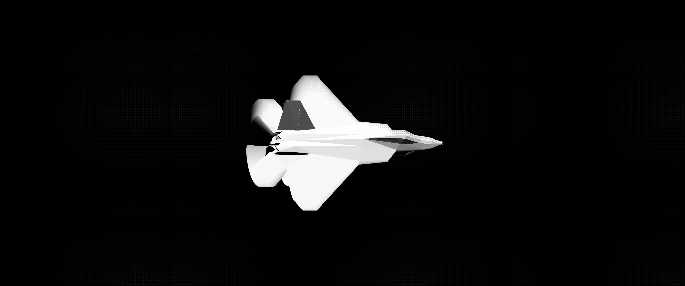

# CPU Renderer

This is a learning project which aims at understanding the underlying principles of 3D rendering, hence this is implementing everything on the CPU without relying on any graphics APIs such as OpenGL.




### Running
From a terminal in root directory
```
cargo run
```

### Shortcuts
| Key           | Effect                                    |
|---------------|-------------------------------------------|
| `ESCAPE`      | Quit                                      |
| `S`           | Take screenshot, saved in /screenshot.jpg |
| `NUMPAD 1-4`  | Select render mode (Vertices, Wireframe, Solid, SolidWireframe) |
| `C`           | Enable backface culling                   |
| `D`           | Disable backface culling                  |

### Features
- Transforms and cameras
- 3D projection and triangle rasterization
- Basic OBJ model loading
- Basic lighting
- Backface culling

### Known issues
- main is doing a lot of rendering instead of just using the engine
- It is not possible to use Window's screenshot tool as it locks the surface's buffer (most likely would require a front/back buffer system)